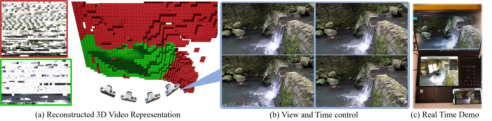

# 3D Video Loops from Asynchronous Input
This repository is the official code for the CVPR23 paper: **3D Video Loops from Asynchronous Input**. Please visit our [project page](https://limacv.github.io/VideoLoop3D_web/) for more information, such as supplementary, demo and dataset.



## 1. Introduction
In this project, we construct a 3D video loop from multi-view videos that can be asynchronous. The 3D video loop is represented as MTV, a new representation, which is essentially multiple tiles with dynamic textures. This code implements the following functionality: 

1. The 2-stage optimization, which is the core of the paper.
2. An off-line renderer that render using pytorch slowly.
3. Evaluation code that compute metrics for comparison.
4. Scripts for data preprocessing and mesh export.

There is another WebGL based renderer implemented [here](https://github.com/limacv/VideoLoopUI), which renders the exported mesh in real time even on an old iPhone X.

## 2. Train on dataset

### 2.1 prerequisite

- The optimization is quite memory consuming. It requires a GPU with memory >= 24GB, e.g. RTX3090. Make sure you have enough GPU memory!
- Install dependencies in the ```requirements.txt```
```
conda create -n vloop3d python==3.8
conda activate vloop3d
pip install -r requirements.txt
```
- Install Pytorch3D following the instructures [here](https://github.com/facebookresearch/pytorch3d/blob/main/INSTALL.md).

### 2.2 dataset
Download dataset from the link [here](https://hkustconnect-my.sharepoint.com/:f:/g/personal/lmaag_connect_ust_hk/EiZnIyUYmJdLpQ5hiLtkz8IBfAyeoUiXHt5H0-pFgzV9cg?e=OBNIas). Place them somewhere. For example, you've placed ```fall2720p``` in ```<data_dir>/fall2720p```.

### 2.3 config path
In the ```configs/mpi_base.txt``` and ```configs/mpv_base.txt```, change the ```prefix``` dir to ```<data_dir>```. 

Then later all the files will be stored in the ```<prefix>/<expdir>/<expname>```. In the example it will be ```<data_dir>/mpis/108fall2``` and ```<data_dir>/mpvs/108fall2```.

### 2.4 stage 1:
In this stage, we generate static Multi-plane Image (MPI) and 3D loopable mask (typically 10-15mins).
Run following:
```
python train_3d.py --config configs/mpi_base.txt --config1 configs/mpis/$DATA_NAME.txt
```

### 2.5 stage 2:
After stage 1 finishes, run following. Note this will load **epoch_0119.tar** file generated in stage 1. In stage 2, we generate final 3D looping video using looping loss (typically 3-6h).
```
python train_3dvid.py --config configs/mpv_base.txt --config1 configs/mpvs/$DATA_NAME.txt
```

After stage 2 finishes, you can get a 3D video loop saved as *.tar file.

## 3. Offline Render
To render the MPV, you can run the following script:
```
python scripts/script_render_video.py  --config configs/mpv_base.txt --config1 configs/mpvs/$DATA_NAME.txt <cfg_vt>
```
We offer very simple control over time and view ```<cfg_vt>```.
- If not specify ```<cfg_vt>```: render the spiral camera pose similar as NeRF.
- If ```<cfg_vt> = --t 0:10 --v 3```: render 3-th training pose from 0 to 10 frames. 

The rendering results will be saved at ```<prefix>/<expdir>/<expname>/renderonly/*```

## 4. Evaluation
To evaluate the results, you can run the following script:
```
python scripts/scripts_evaluate_ours.py --config configs/mpv_base.txt --config1 configs/mpvs/$DATA_NAME.txt
```
This will generate ```<prefix>/<expdir>/<expname>/eval_metrics.txt```, which contains values for each metric. 

## 5. Export mesh

To export mesh:
```
python scripts/scripts_export_mesh.py --config configs/mpv_base.txt --config1 configs/mpvs/$DATA_NAME.txt
```
This will generate mesh files under ```<prefix>/<expdir>/meshes/<expname>```. 

## 6. Online Renderer

Please refer to [this repo](https://github.com/limacv/VideoLoopUI) for more details.

## 7. Using your own data

The dataset file structure is fairly straightfoward, and the camera pose file 
follows those in the [LLFF dataset](https://github.com/Fyusion/LLFF) in the NeRF paper.
So it should be easy to create and structure your own dataset. 

But still, we provide some simple scripts to help create your own dataset.

### 7.0 capture your data

One limitation of our method is that 
we only support scenes with textural motion and repeatitive pattern.
So the best practice is to capture water flows. 

During capturing, the best option is to use a tripod, 
which perfectly guarantees the camera pose to be static. 
If you hand-hold your camera, make sure it's still, and later
you can stabilize the video using software. 
But this may lead to artifact in the results (also a future work).

Also make sure there is enough static region so that the COLMAP works.

### 7.1 structuralize data

I usually start by using video editing softwares to 
concatenate multi-view videos into a long video, 
with each interval have some black frames. 
This helps to standardize the fps, remove the sound, stabilize, etc.

Then run the following to create a structured dataset: 
```
cd scripts
python script_owndata_step1_standardization.py \
    --input_path <video_name> \
    --output_prefix <dataset_dir>
```

### 7.2 pose estimation

Make sure you install the [COLMAP](https://colmap.github.io/). 
Then assign the colmap executable path to variable ```colmap_path``` 
in the file ```scripts/colmaps/llffposes/colmap_wrapper.py```

Then run:
```
python script_owndata_step2_genllffpose.py \
    --scenedir <dataset_dir>
```

## Other Notes

- Implementation details for the looping loss:
    - Pytorch unfold eats lots of GPU memory. Since the looping loss is computed for each pixel location, we save the memory by looping through macro_block, which yields same results but lower memory usage.
    - Instead of directly computing the loss between Q and K, we first assemble a retargeted video loop by folding the K<sub>f(i)</sub>. We find that this operation greatly reduces the training memory and training time.
- In each iteration, we randomly perturb the camera intrinsic for half pixel (i.e. cx += rand() - 0.5, same for cy). We find this can reduce the tiling artifact. See the demo [here](https://limacv.github.io/VideoLoopUI/?dataurl=assets/ustfall1_tiling) for adding this perturb and [here](https://limacv.github.io/VideoLoopUI/?dataurl=assets/ustfall1) for without perturb. There is still some artifact when render in high resolution (the training is conducted in 640x360).